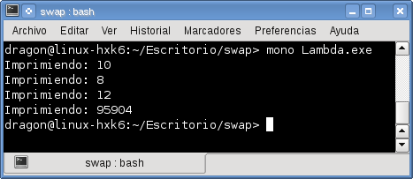
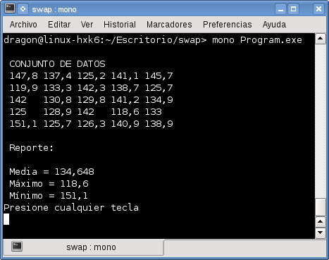

# Expresiones Lambda (Lambda Expressions) con C#

Las expresiones lambda provienen del cálculo lambda (lambda calculus) desarrollado por Alonzo Church en los años 1930’s como una notación para representar todas las funciones computables equivalentes a una máquina de Turing, todos los lenguajes funcionales pueden ser vistos como una variante sintáctica del cálculo lambda.
Las expresiones Lambda son útiles para sintetizar funciones con pocos parámetros que regresan algún valor, esta expresión consiste básicamente en una regla de sustitución que expresa tal cual una función o sea un mapeo de los elementos del conjunto dominio a los elementos de un codominio por ejemplo en la siguiente expresión:

<pre>
cuadrado : integer → integer donde cuadrado(n) = n²
</pre>

Aunque C# no utiliza los símbolos de la notación matemática lambda, el operador lambda es => que significa “tiende a” o “va hacia a”, la estructura de una expresión lambda en C# es:

<pre>
(Argumentos de entrada) => (salida al procesarlos)
</pre>

Veamos algunos ejemplos:
<ol>
<li>Primer ejemplo usando expresiones lambda</li>
<li>Segundo ejemplo usando funciones estaticas</li>
</ol>

La salida del programa es la siguiente imagen

Ahora un ejemplo con funciones estadísticas:

la salida de este ejemplo es la siguiente imagen

Es importante saber que es el tipo delegate que dicta el tipo de los parámetros de entrada y de salida.

